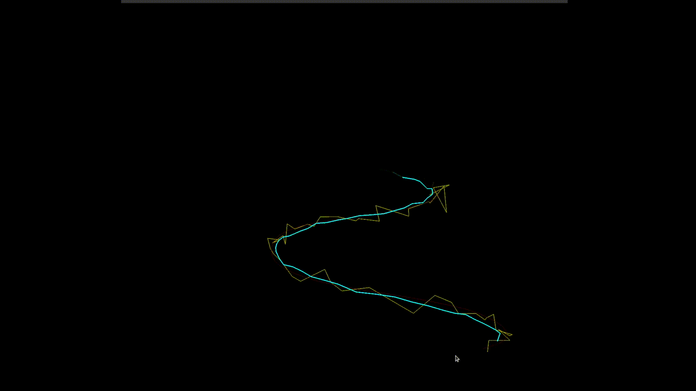

# Kalman Filter for Cursor Position Estimate



This is a minimal Python demo that uses the Kalman filter to estimate the position of the mouse cursor. The system assumes constant velocity motion and Gaussian noise, making it a linear-Gaussian system. Under these assumptions, the Kalman filter provides the best linear unbiased estimate of the system state. For this demo, the recursive estimator will track the 4-dimensional state of the cursor:

$$
\mathbf x_k = 
\begin{bmatrix}
x_k \\
y_k \\
\dot x_k \\
\dot y_k 
\end{bmatrix}
\tag{1}
$$

Where
- $x$, $y$ represent the cursor's 2D position [pixels]
- $\dot x$, $\dot y$ represent the cursor's velocities along each axis [pixels/s]


## System Model

**Motion model:**

```math
\mathbf{x}_k = \mathbf{A} \mathbf{x}_{k-1} + \mathbf{w}_{k}, \quad \mathbf{w} \sim \mathcal{N}(0, \mathbf{Q}_{k})
\tag{2}
```

**Measurement model:**

$$
\mathbf{y}_k = \mathbf{C} \mathbf{x}_{k} + \mathbf{n}_{k}, \quad \mathbf{n} \sim \mathcal{N}(0, \mathbf{R}_{k})
\tag{3}
$$

Here, $\mathbf{A}$ is the state transition matrix, $\mathbf{C}$ is the measurement matrix, and $\mathbf{Q}_k$, $\mathbf{R}_k$ are the process and measurement noise covariances, respectively. Both noise terms are assumed to be zero-mean Gaussian. 

### State Transition and Measurement Matrices

The system assumes the cursor moves with constant velocity in both axes. Using the state defined in $(1)$, at each timestep, the new position is computed from the previous position and velocity:

$$
x_k = x_{k-1} + \dot{x}_{k-1} \Delta t \\
\tag{4.1}
$$
$$
y_k = y_{k-1} + \dot{y}_{k-1} \Delta t \\
\tag{4.2}
$$
$$
\dot{x}_k = \dot{x}_{k-1} \\
\tag{4.3}
$$
$$
\dot{y}_k = \dot{y}_{k-1} \\
\tag{4.4}
$$

Stacking these equations into vector form, we obtain the following state transition matrix:

$$
\mathbf{A} =
\begin{bmatrix}
1 & 0 & \Delta t & 0 \\
0 & 1 & 0 & \Delta t \\
0 & 0 & 1 & 0 \\
0 & 0 & 0 & 1
\end{bmatrix}
\tag{5}
$$

The measurement vector includes only the 2D position of the cursor which corresponds to the first two elements of the state vector:

$$
\mathbf{C} =
\begin{bmatrix}
1 & 0 & 0 & 0 \\
0 & 1 & 0 & 0
\end{bmatrix}
\tag{6}
$$

Substituting $(1)$ and $(5)$ into $(2)$, we obtain the motion model:


$$
\mathbf x_k = 
\begin{bmatrix}
x_k \\[6pt]
y_k \\[6pt]
\dot x_k \\[6pt]
\dot y_k 
\end{bmatrix}

= 

\begin{bmatrix}
1 & 0 & \Delta t & 0 \\
0 & 1 & 0 & \Delta t \\
0 & 0 & 1 & 0 \\
0 & 0 & 0 & 1
\end{bmatrix}

\begin{bmatrix}
x_{k-1} \\[6pt]
y_{k-1} \\[6pt]
\dot x_{k-1} \\[6pt]
\dot y_{k-1} 
\end{bmatrix}

+

\begin{bmatrix}
w_{x,k} \\[6pt]
w_{y,k} \\[6pt]
w_{\dot{x}, k} \\[6pt]
w_{\dot{y}, k} \\[6pt]
\end{bmatrix}

\tag{7}
$$

and substituting $(1)$ and $(6)$ into $(3)$, we obtain the measurement model:

$$
\mathbf y_k = 
\begin{bmatrix}
x_{meas,k} \\[6pt]
y_{meas,k} \\[6pt]
\end{bmatrix}

= 

\begin{bmatrix}
1 & 0 & 0 & 0 \\
0 & 1 & 0 & 0
\end{bmatrix}

\begin{bmatrix}
x_k \\[6pt]
y_k \\[6pt]
\dot x_k \\[6pt]
\dot y_k 
\end{bmatrix}

+

\begin{bmatrix}
n_{x,k} \\[6pt]
n_{y,k} \\[6pt]
\end{bmatrix}

\tag{8}
$$

### Noise Covariances Matrices

For the process and measurement noise covariance matrices, we assume that the noise in each state variable and each measurement is independent and Gaussian. Therefore, the process and measurement noise covariances are modeled as diagonal matrices:

$$
\mathbf{Q}_k = 
\begin{bmatrix}
\sigma_x^2 & 0 & 0 & 0 \\
0 & \sigma_y^2 & 0 & 0 \\
0 & 0 & \sigma_{\dot{x}}^2 & 0 \\
0 & 0 & 0 & \sigma_{\dot{x}}^2
\end{bmatrix} 
\tag{9}
$$

$$
\mathbf{R}_k = 
\begin{bmatrix}
\sigma_{x,meas}^2 & 0  \\
0 & \sigma_{y,meas}^2  \\
\end{bmatrix} 
\tag{10}
$$

These values are manually chosen to balance trust between the motion model and the measurements. In practice, they are tuned to optimize tracking performance. Intuitively, larger values in $Q_k$ corresponds to higher uncertainty in the motion model (less trust in the motion model), and larger values in $R_k$ corresponds to higher uncertainty in the measurements (less trust in the measurements).


## Kalman Filter
Given the linear system dynamics defined above, the Kalman filter provides an optimal recursive estimator under the assumption of Gaussian noise. The Kalman filter operates in two steps: **prediction** and **correction**. The canonical form of the Kalman filter is as shown below:

### **1. Prediction Step**

$$
\check{\mathbf{P}}_{k} = \mathbf{A}_{k-1} \hat{\mathbf{P}}_{k-1} \mathbf{A}_{k-1}^\top + \mathbf{Q}_k
\tag{11.1}
$$

$$
\check{\mathbf{x}}_{k} = \mathbf{A}_{k-1} \hat{\mathbf{x}}_{k-1}
\tag{11.2}
$$


### **2. Correction Step**

$$
\mathbf{K}_k = \check{\mathbf{P}}_{k} \mathbf{C}_k^\top (\mathbf{C} \check{\mathbf{P}}_k \mathbf{C}_k^\top + \mathbf{R}_k)^{-1}
\tag{11.3}
$$

$$
\hat{\mathbf{P}}_{k} = (\mathbf{1} - \mathbf{K}_k \mathbf{C}_k) \check{\mathbf{P}}_{k}
\tag{11.4}
$$

$$
\hat{\mathbf{x}}_{k} = \check{\mathbf{x}}_{k} + \mathbf{K}_k(\mathbf{y}_k - \mathbf{C} \check{\mathbf{x}}_{k})
\tag{11.5}
$$

Where
- $\check{\mathbf{P}}_k$ represents the predicted covariance
- $\check{\mathbf{x}}_k$ represents the predicted state
- $\mathbf{K}_k$ represents the Kalman gain
- $\hat{\mathbf{P}}_k$ represents the estimated covariance
- $\hat{\mathbf{x}}_k$ represents the estimated state


During the prediction step, the filter projects the current state estimate and its uncertainty forward in time using the motion model. This yields the predicted state, $\check{\mathbf{x}}_k$, and predicted covariance, $\check{\mathbf{P}}_k$.

The correction step then incorporates a new measurement, $\mathbf{y}_k$, to update the state estimate. The Kalman gain, $\mathbf{K}_k$, determines how much the filter adjusts the prediction based on the new measurement.

Intuitively, Kalman gain balances trust between the model and the measurement. If the predicted uncertainty, $\check{\mathbf{P}}_k$, is large (i.e. the model is uncertain), the gain increases, and the filter places more weight on the measurement. On the other hand, if the measurement noise, $\mathbf{R}_k$, is large, the gain decreases, and the filter relies more on the model's prediction.

In essence, the Kalman filter computes a weighted average of the predicted state and the new measurement, where the weighting is dynamically determined by the relative uncertainty in each. This makes an efficient and adaptive estimator that continuously corrects itself in real time.